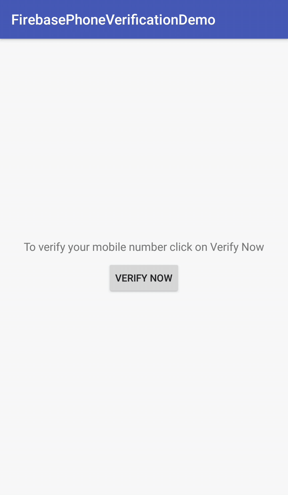

<h1>Introduction</h1>

INTUZ is presenting a custom Firebase Phone Authentication in Android,Just go through this tutorial and you will be good to go.

<br>
<h1>Features</h1>

- Ability to customize according to your requirement.
- Ability send sms and auto read code, Also you can resend the code if sms is not delivered on time.
- Easy to integrate

<br>


<h1>Getting Started</h1>

1. Setup your app in firebase console at: https://console.firebase.google.com/
1. Add your SHA-1 key in firebase console.
1. Enable Phone Number sign-in for your Firebase project
1. To sign in users by SMS, you must first enable the Phone Number sign-in method for your Firebase project:
1. In the Firebase console, open the Authentication section.
1. On the Sign-in Method page, enable the Phone Number sign-in method.


> Permission and declaration in AndroidManifest.xml file

```
    <uses-permission android:name="android.permission.INTERNET" />
    <uses-permission android:name="android.permission.ACCESS_WIFI_STATE" />
    <uses-permission android:name="android.permission.ACCESS_NETWORK_STATE" />
    <uses-permission android:name="android.permission.RECEIVE_SMS" />
    <uses-permission android:name="android.permission.READ_SMS" />
    <uses-permission android:name="android.permission.READ_PHONE_STATE" />
```


> You can customize button color, toolbar color etc by using below code in your app's style.xml

```
     <style name="Theme.Phone.Verification" parent="Theme.AppCompat.Light.NoActionBar">

        <!-- Color Palette -->
        <item name="colorPrimary">@color/colorPrimary</item>
        <item name="colorPrimaryDark">@color/colorPrimaryDark</item>
        <item name="colorAccent">@color/colorAccent</item>

        <!-- Here we define our custom attributes -->
        <item name="verification_button_color">@color/colorPrimary</item>
        <item name="title_of_mobile_verification">@string/app_name</item>

    </style>
```

> Start Phone verification by putting below code in your view :

```
                Intent intent = new Intent(MainActivity.this, PhoneNumberActivity.class);
                //Optionally you can add toolbar title
                intent.putExtra("TITLE", getResources().getString(R.string.app_name));
                //Optionally you can pass phone number to populate automatically.
                intent.putExtra("PHONE_NUMBER", "");
                startActivityForResult(intent, REQUEST_PHONE_VERIFICATION);

```

> Handle your onActivityResult for getting phone number auth result as:

```
    @Override
    protected void onActivityResult(int requestCode, int resultCode, Intent data) {
        super.onActivityResult(requestCode, resultCode, data);
        switch (requestCode) {
            case REQUEST_PHONE_VERIFICATION:
// If mobile number is verified successfully then you get your phone number to perform further operations.
                if (data != null && data.hasExtra("PHONE_NUMBER") && data.getStringExtra("PHONE_NUMBER") != null) {
                    String phoneNumber = data.getStringExtra("PHONE_NUMBER");
                    mobileNumber = phoneNumber;
                } else {
                    // If mobile number is not verified successfully You can hendle according to your requirement.
                    Toast.makeText(MainActivity.this,getString(R.string.mobile_verification_fails),Toast.LENGTH_SHORT);
                }
                break;
        }
    }
```


<h1>Bugs and Feedback</h1>

For bugs, questions and discussions please use the Github Issues.

<br>
<h1>License</h1>

Copyright (c) 2018 Intuz Solutions Pvt Ltd.
<br><br>
Permission is hereby granted, free of charge, to any person obtaining a copy of this software and associated documentation files (the "Software"), to deal in the Software without restriction, including without limitation the rights to use, copy, modify, merge, publish, distribute, sublicense, and/or sell copies of the Software, and to permit persons to whom the Software is furnished to do so, subject to the following conditions:
<br><br>
THE SOFTWARE IS PROVIDED "AS IS", WITHOUT WARRANTY OF ANY KIND, EXPRESS OR IMPLIED, INCLUDING BUT NOT LIMITED TO THE WARRANTIES OF MERCHANTABILITY, FITNESS FOR A PARTICULAR PURPOSE AND NONINFRINGEMENT. IN NO EVENT SHALL THE AUTHORS OR COPYRIGHT HOLDERS BE LIABLE FOR ANY CLAIM, DAMAGES OR OTHER LIABILITY, WHETHER IN AN ACTION OF CONTRACT, TORT OR OTHERWISE, ARISING FROM, OUT OF OR IN CONNECTION WITH THE SOFTWARE OR THE USE OR OTHER DEALINGS IN THE SOFTWARE.

<h1></h1>
<a href="http://www.intuz.com">

</a>
